# Speech Recognition

* [Overview](#Overview)
    * [Different Variations of Tokens](#Different-Variations-of-Tokens)
        * [Phoneme](#Phoneme)
        * [Grapheme](#Grapheme)
        * [Word](#Word)
        * [Morpheme](#Morpheme)
        * [Byte](#Bytes)
        * [Percentage of usage of different type of tokens](#Percentage-of-usage-of-different-type-of-tokens)
    * [Acoustic Feature](#Acoustic-Feature)
        * [How to obtain acoustic feature](#How-to-obtain-acoustic-feature)
        * [Percentage of usage of different type of acoustic feature](#Percentage-of-usage-of-different-type-of-acoustic-feature)
    * [Amount of Data](#Amount-of-Data)

* [Speech Recognition Models](#Speech-Recognition-Models)

# Overview

* Speech recognition converts **speech** to **text**
* Speech can be represented using sequence of vectors with length **T** and number of dimension **D**
* Text can be represented using sequence of **tokens** with length **N**
* **V** denotes the number of different tokens, it is a fixed number
* Usually, **T** > **N**

## Different Variations of Tokens

### Phoneme
* A unit of sound 
* For example: The phonemes which make up <code>One Punch Man</code>
> * <code>W AH N P AH N CH M AE N</code>
* Requires **lexicon** which is basically a dictionary of words to phonemes
* Prior to Deep Learning era, phoneme is a widely used choice of token because it is directly related to sound signal
* Disadvantage: requires experts such as linguists to build the lexicon for every words

### Grapheme
* Smallest unit of a writing system
* For English, smallest units of writing system are 26 English alphabets
* Needs to add a symbol **_** which represents blank spacing between different words
* For example:
>*  one_punch_man
* It has **N** = 13, **V** = 26 and more
* In addition, punctuation marks such as <code> , </code>
* For writing system such as Chinese, the grapheme are the Chinese characters
* For example, One Punch Man consists of 4 characters
>* 一 , 拳 , 超 , 人
* On the other hand, grapheme for Chinese does not require spacing
* Advantages: 
    * Lexicon free. Does not require linguists to build the lexicons
    * The model may learn to construct words that do not exist in the training set
* Disadvantage:
    * Does not have clear or direct relationship with sound
    * For example, the first phoneme for words *cat* and *Kate* is  **/kæt/**, whereas, the first grapheme are *c* and *k* respectively
    * Huge challenge for the model to learn the complicated relationship between sound and graphemes

### Word
* For example:
    * One Punch Man
    * **N** = 3 because it consists of 3 words
    * usually **V** > 100K
    * Names for people, places are also words
* For some language, using words as token is difficult
* For example, Chinese words are formed by stacking characters together side by side
* Chinese does not use spacing to differentiate between different words
    * 一拳，超人 are two words in Chinese
* For some languages, using words as token is not suitable
* This is because **V** is too large
* For example, agglutinative languages such as Turkish
    
### Morpheme
* The smallest meaningful unit
* Greater than grapheme, but smaller than word
* For example, the English word *unbreakable* can be broken down into 3 morphemes: *un*, *break* and *able*

### Bytes
* Symbols for different language can be represented using UTF-8
* Texts can be represented using sequence of bytes
* The system can be language independent
* **V** is always 256
* Paper [Li, et al., ICASSP 2019]

### Percentage of usage of different type of tokens

| Token Type | Percentage |
|------------|------------|
| Phoneme    | 32%        |
| Grapheme   | 41%        |
| Word       | 10%        |
| Morpheme   | 17%        |

* After going through more than 100 papers from ICASSP 2019, INTERSPEECH 2019, ASRU 2019
* Grapheme is the most widely used choice because it doesn't require lexicons
* Phoneme is the second most widely used choice because it is directly related to sound
* The least used is word

Others 

|              Input              |                           Output                           |
|:-------------------------------:|:----------------------------------------------------------:|
| Speech                          | Word embeddings                                            |
| Speech                          | Speech recognition + Translation                           |
| Speech : One ticket to Taipei  | Speech recognition + Intent classification <buy_ticket> |
| Speech :  One ticket to Taipei | Speech recognition + Slot filling NA NA NA LOC    |

## Acoustic Feature

* Use a sliding window of size 25ms, with step size 10ms to segment the speech signal
* A frame consists of 400 sample points if the sampling frequency is 16KHz
    > 16Khz x 25ms = 400
* Represent the 25ms speech signal with a vector:
    * Use 400 sample points (400-dim vector)
    * 39-dim MFCC
    * 80-dim filter bank output
* MFCC is widely used before deep learning era
* Filter banks are becoming popular
* After obtaining vector, move the sliding window by 10ms, take another 25ms frame and represent it using vector
* 1 second of speech signal results in 100 frames
* There is a overlap between neigboring frames
* Due to the overlap, some of the values of a vector is repeated in vector of neighboring frame
* Can improve the model architecture and reduce cost by targetting this characteristic

### How to obtain acoustic feature

* The first step is to obtain spectogram from speech waveform using Fourier Transform
* Waveform is too complicated to be used directly as input for Speech Recognition
* This is because the same sound can result in very different looking waveforms
* On the other hand, it is possible for human to guess what was spoke by looking at the spectrogram
* The spectrogram has a more direct relationship with sound compared to waveform
* After that, the spectrogram is passed through filter banks
* Usually, the output of filter banks are **log**ed
* Then after doing DCT, we will get **MFCC**

### Percentage of usage of different type of acoustic feature

| Type of acoustic feature | Percentage |
|:------------------------:|:----------:|
| filter bank output       |        75% |
| MFCC                     |        18% |
| Spectrogram              |         2% |
| Waveform                 |         4% |
| Other                    |         1% |

* After going through more than 100 papers from ICASSP 2019, INTERSPEECH 2019, ASRU 2019
* Prior to deep learning era, **MFCC** is the most widely used acoustic feature
* Filter bank output has overtaken MFCC as choice for acoustic feature

### Amount of Data 

* Requires speech data labelled with texts
* **TIMIT** is the "MNIST" of Speech Recognition

| Data                                               | Length in time |
|----------------------------------------------------|----------------|
| MNIST                                              | "49 min"       |
| CIFAR-10                                           | "2 hr 40 min"  |
| TIMIT                                              | 4 hr           |
| WSJ                                                | 80 hr          |
| Switchboard                                        | 300 hr         |
| Librispeech                                        | 960 hr         |
| Fisher                                             | 2000 hr        |
| ISLVRC (ImageNet)                                  | "4096 hr"      |
| Google Voice Search [Chiu, et al., ICASSP,2018] | 12000 hr ++    |
| FB Video [Huang, et al., arXiv 2019]            | 13000 hr ++    |

* Treat MNIST as if it is speech data
    * 28 x 28 x 1 x 60000 / (16000 x 60) = 49 min
* CIFAR-10:
    * 32 x 32 x 3 x 50000 / (16000 ) = 2 hr 40 min
* Both MNIST and CIFAR-10 are smaller than TIMIT
* Research papers show that Google Voice Search uses 12000 hr plus of data
* However, commercial products use more than that, probably about 10 or 20 times more dataset

* Two points of views for Speech Recognition: 
    1. Seq-toSeq model
    2. Hidden Markov Model (HMM)

# Speech Recognition Models 
* Listen, Attend, and Spell [Chorowski, et al.,NIPS'15]
* Connectionist Temporal Classification (CTC) [Graves, et al., ICML'06]
* RNN Transducer (RNN-T) [Graves, ICML workshop'12]
* Neural Transducer [Jaitly, et al., NIPS'16]
* Monotonic Chunkwise Attention (MoCha) [Chiu, et al., ICLR'18]

| Model      | Percentage |
|------------|------------|
| LAS        | 40%        |
| CTC        | 24%        |
| LAS + CTC  | 11%        |
| RNN-T      | 10%        |
| HMM-hydrid | 15%        |

* LAS is a Seq2Seq model, still widely used
* Neural Transducer and MoCha are relatively lastest techniques
* HMM hybrid combines HMM and deep learning technique
* Nowadays, almost no people do Speech Recognition without using deep learning 

# Listen, Attend, and Spell (LAS)
* LAS is a typical Seq2Seq model with attention
* Listen refers to the encoder part 
* Spell refers to the decoder part
* Attend refers to the attention part
* Why is it called LAS, not Seq2Seq model ?
    * There was a time when it's popular to use three verbs as the title of paper, now it's outdated
    * Other Speech Recognition models are also Seq2Seq model
    * People will not know which model you refer to if you called it Seq2Seq model

## Listen: Encoder Choice
* Listen refers to the encoder part

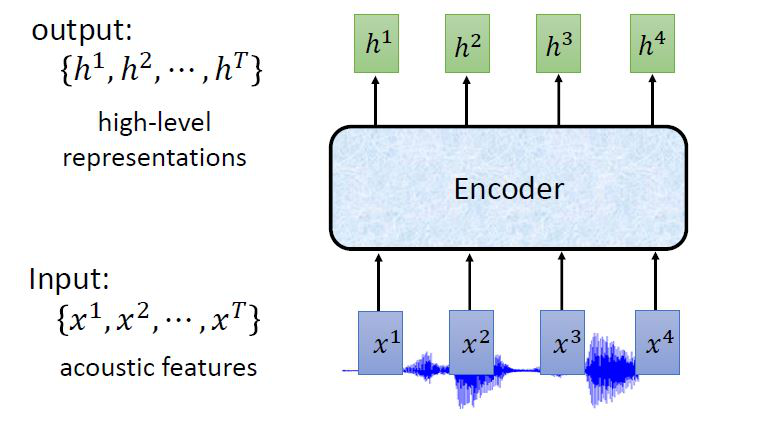

* Encoder is a Seq2Seq model which takes the sequence of acoustic features as input and outputs high level representations of the acoustic feature sequence
* **x** denotes the input sequence of acoustic features
* **h** denotes the output sequence of vectors
* We hope that the encoder extracts content information and remove speaker variance and noises
* Speaker variance means variations in acoustic features due to different speakers
* The choice of encoder:
    * RNN
    * 1D CNNs

* Using 1D Convolutional Neural Network (CNN), the triangle represents the filter
* The filter performs convolution on acoustic features which is in window
* Then the filter is slided rightwards, another convolution on another window of acoustic features
* A value is contributed at each time step when moving the filter right 
across time steps

* There are more than one filters (different colors)
* Each filter contributes to a value at each time step 
* Filters at higher level can consider longer sequence of acoustic features
* It is common to combine CNN and RNN

## Listen: Down Sampling
* Down Sampling is important in Speech Recognition
* For acoustic feature, 1 seconds of speech results in 100 frames or vectors
* This results in very long sequence
* Self-attention for each time step consider entire sequence in
* This is okay for Machine Translation, but not okay for Speech Recognition because the sequence is too long
* Neighboring vectors share info due to overlap of sliding window
* Down Sampling increases efficiency and reduce computational cost
* Very important, the author mentioned unsuccesful to train LAS without down sampling

**Down Sampling Methods :**

* Pyramid RNN: Each time step of higher layer takes several output of time steps of lower layer as input
* Pooling over time: Each time step of higher layer skips some time step of lower layer

* Time-delay DNN (TDNN) : Similar to 1D CNN, but only consider first and final frame 
* Truncated Self-attention : 
    * Apply attention only to part of the sequence in the range
    * Usually, self-attention will look at whole sequence
    * For example, <code>x3</code> to <code>h3</code> will give attention to <code>x1</code> to <code>x4</code>
    * Truncate the range, now it only looks at <code>x2</code> to <code>x4</code>
    * The range is a hyperparameter

## Attention

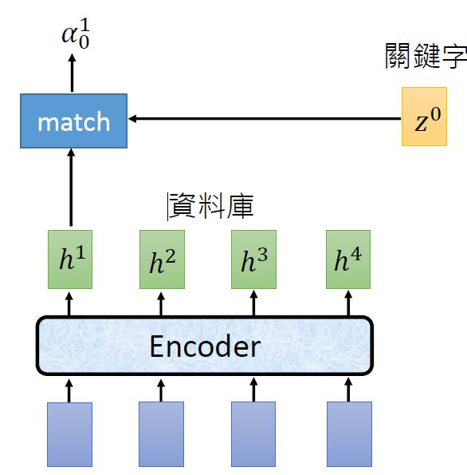

* Encoder transforms the input sequence into a sequence of vectors **h**
* There is a vector denoted by **z0**
* Self-attention can be seen as doing a Google Search
* Where **z0** is the keyword and sequence h1, h2, h3, h4 is the database
* There is a **match** function which takes h1 and z0 as input and outputs a scalar <code>alpha_0_1</code>
* Match function can be seen as calculating the similarity between the vectors h1 and z0
* There are two types of match function

**Dot Product Attention**

* Do linear transform to both **h** and **z**
* Results in 2 vectors with same dimensions
* Then do dot product, which results in a scalar **α**

**Additive Attention**

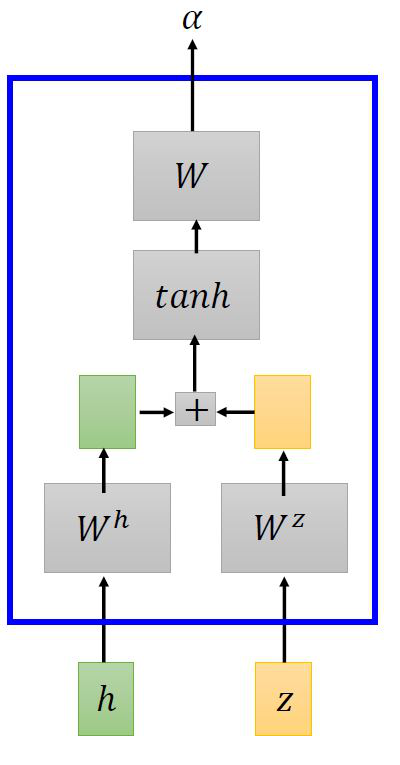

* Perform linear transform to both **h** and **z**
* Add both transformed vectors
* Apply **tanh** resulting in a vector
* Multiply with **W** results in a scalar **α**

* Then the <code>alpha</code> are passed through a softmax layer
* The output of the softmax layer sums to one 
* <code>alpha</code> can be seen as a measure of similarity between <code>z</code> and <code>h</code>
* The context vector <code>c_0</code> is a weighted average of the **h** vectors at each time step, weighted by the softmax's output
* Only those **h_t** with lots of similarity with **z0**  contribute to the context vector
* Note that describing self-attention with analogy of google search and similarity is just for understanding
* The context vector is the input for the RNN decoder

## Spell

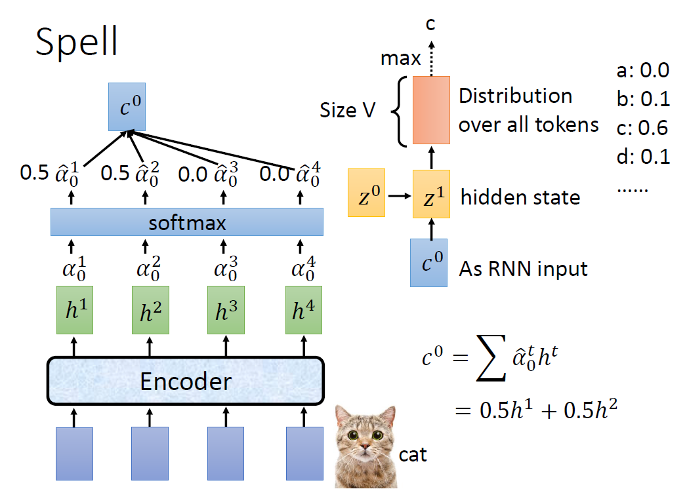

* The decoder is a RNN
* At the first time step of decoder, **z0** and **c0** are the input, the hidden state output is **z1**
* **z1** then undergoes some transform to output distribition over all tokens
* The distribution is a vector of size **V**
* Assigning probabilities to each of the **V** possible tokens
* As shown in the above figure, at the first time step, the decoder assigns 0.0 to a, 0.1 to b and so on
* There are two ways to select a token based on probabilities
* Selecting the token which maximizes the distribution at each time step is called greedy search approach
* Using greedy approach, the token to be selected at the first time step is *c*
* Another method is called beam search which is usually used, will be discussed later

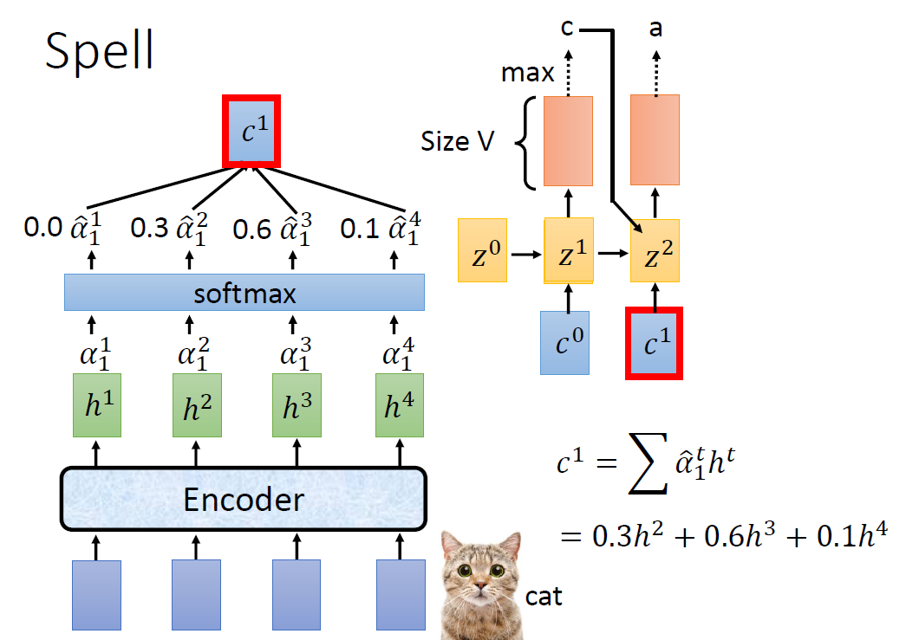

* The output of the hidden state at first time step is **z1**, this vector is used to compute **c1** 
* At the second time step, calculate the distribution vector with **z0**,**c1** and the token *c* as input
* The token to be selected at second time step is *a*

* Repeat the step, until <EOS> is selected. <EOS> is a token which symbolizes **end of sentence**

### Beam Search

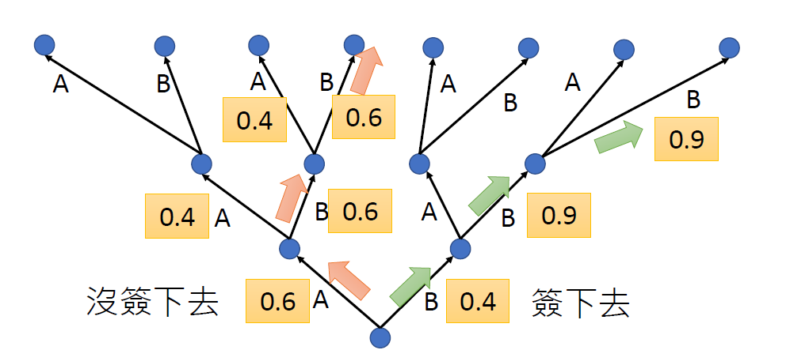

* To illustrate beam search, assume there are two tokens **A** and **B** only
* The way to look at the tree in the figure is from the bottommost
* At the first time step, there are two choices, the values at the edge is the output of the decoder, which can be interpreted as assigned probability for each token
* In practice, we will log the probability. This is because the values might be too small if **V** is large
* If **A** is selected at the first time step, this leads to another two possible choices at the second time step
* Similarly, if we choose any of the token at any time step
* The red path is when we use greedy approach, selecting the token with maximum probability at each time step
* Using greedy approach during decoding does not promise or help to get output sequence with the highest probabilty
* For green path, the first time step is B with 0.4, the second time step is 0.9 and the third step 0.9
* Selecting lower probability choice currently, but in the long run may result in better path
* Beam search keeps **B** best pathes at each time step
* If **B** = 2, 2 paths with the highest probability multiplied together will be kept at each time step
* This is better than greedy aprroach in decoding
* **B** is a hyperparameter to be set

## Training

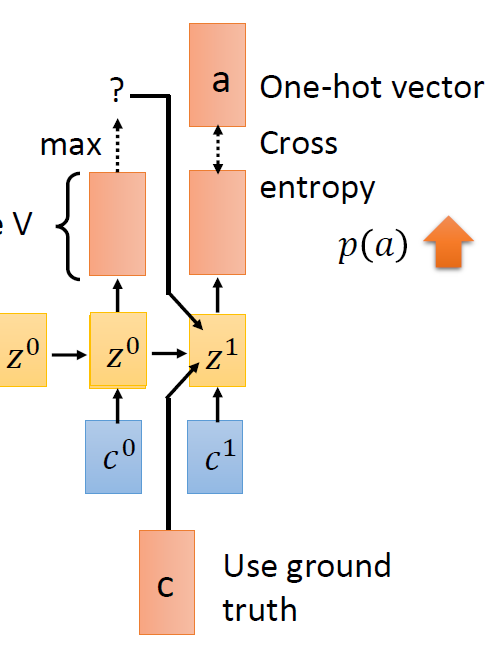

* During training, one-hot vector is used as target 
* The prediction from previous time step is not used as input in current time step
* Instead, the ground truth for previous time step is used as input for current time step
* The goal is to have the output vector to be as close as possible to the one-hot vector
* In other words, minimize cross entropy or p(a) to be as large as possible
* This is called **teacher forcing**

Why teacher forcing ?
* Let say the model is supposed to output *cat*
* Initially, the model outputs 'x' instead of 'c' because the model is very bad at the beginning of training
* If we used'x' as input to second time step, the model might learn to generate 'a' when given 'x', not generating 'a' when given 'c'
* In other words, the model will be learning something wrong, this is wasting training time

## Attention

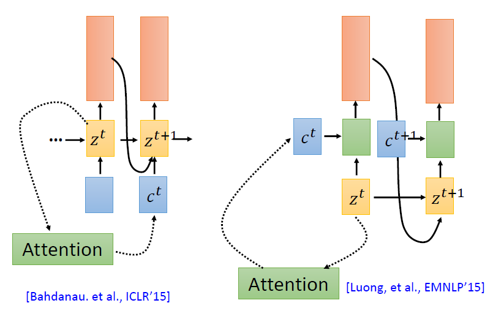

* Two types of attention
* Bahdanau: The calculated context vector is used as input of the next time step
* Luong: The context vector is used in current time step as input

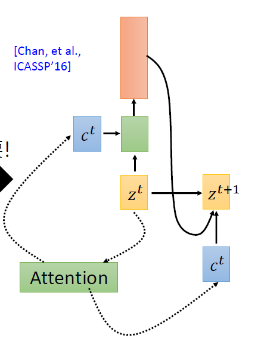 

* Chan: Use both of the attention together
* The author of LAS thinks that attention has too much flexibility
* At each time step, attention looks at entire sequence
* This might be necessary for Machine Translation
* where the first word in the output sequence might be due to final word in the input sequence
* For Speech Recognition, it is not needed
* Intuitively, when decoding a token at a time step, the focus should be on neighboring acoustic features only
* As the model decodes from left to right, the attention weightage should move from left to right also like in the following figure

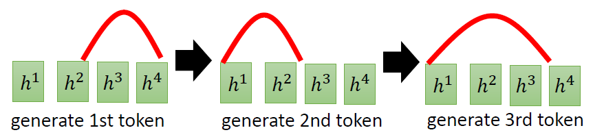 

* But since attention can consider entire sequence
* The attention weightage may jump around instead of moving from left to right when decoding
* The author added a component called Location Aware Attention

### Location Aware Attention

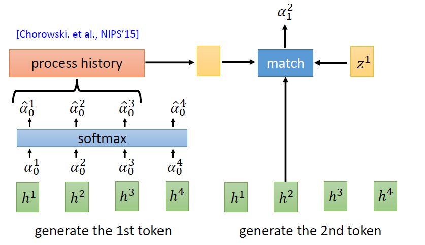 

* Define a window, for example, the window or range is 3 neighboring acoustic features in the figure above
* In short, the attention weights undergo some transform called process history
* Then, it is used as input to the match function
* The model learns to move attention weightage from left to right when decoding

### Does LAS work ?

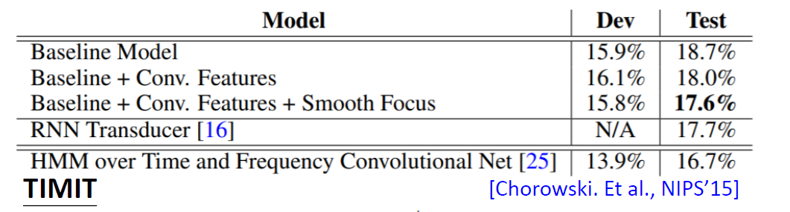 

* In the original paper, the author evaluated it using TIMIT dataset
* The performance does not surpass the hybrid of HMM and deep learning
* However, this result might not be true for actual Speech Recognition using other type of tokens
* TIMIT uses phoneme as token

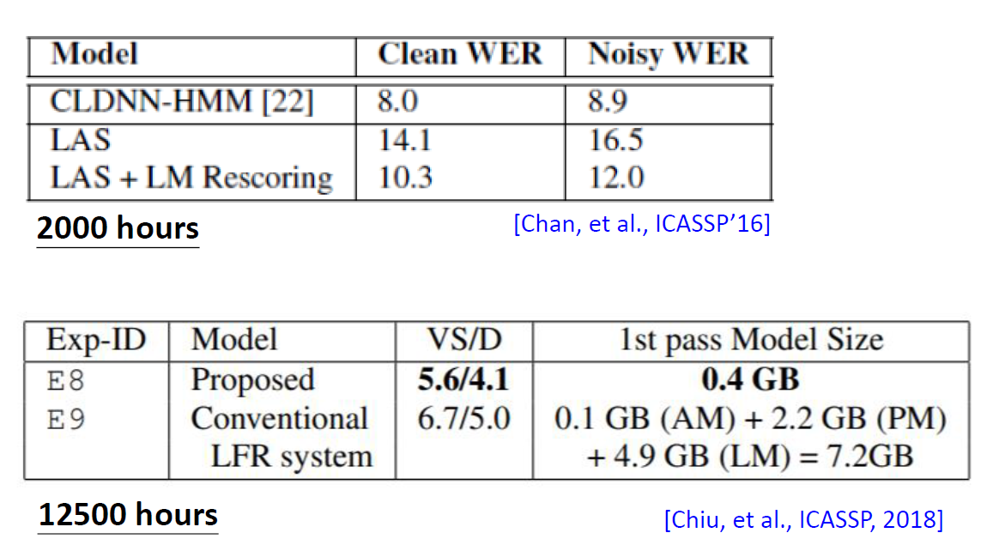 

* Experiments by other researchers showed that LAS beat HMM
* Chiu shows that using end-to-end model like LAS reduced the size of the model
* The conventional LFR system which combines separate models such as Language Model (LM) is much larger than LAS model
* LAS includes Language Model as a end-to-end model
* Of course, adding an extra language model might improve the performance of LAS a little bit

 

* The figure above shows that LAS can learn focus from left to right when decoding even when Location aware attention is not used

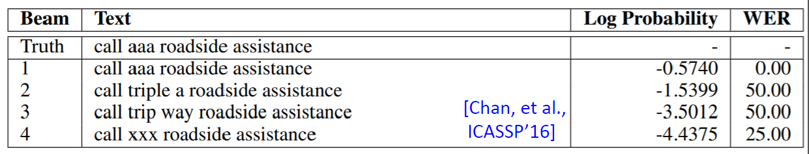 

* The figure above shows an interesting result
* The ground truth is <code>aaa</code>
* The second best path decodes into <code>triple a</code>
* They sound very different
* But it seems LAS is able to learn very complicated relationship between input and output sequence and also the relationship between tokens

## Limits of LAS

* LAS start decoding after listening to the whole input
* User may expect on-line speech recognition
* Which means decoding as user is speaking, instead of decoding after user finished speaking

# Connectionist Temporal Classification

* CTC was introduced by Alex Graves at ICML 2006
* CTC can be used for on-line streaming speech recognition
* Consists of a encoder
* Encoder is some type of uni-directional RNN
* If use bi-directional RNN, cannot perform on-line speech recognition

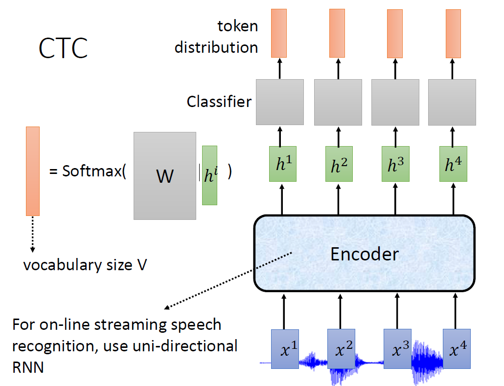 

* At each time step, there is a linear classifier
* Hidden state output **h** is transformed and pass through a softmax layer
* The output of classifier is the token distribution vector with size **V**
* **V** is the vocabulary size
* Each frame consists of only 10ms of acoustic feature
* It is very short
* Difficult to have 1-to-1 relationship between input sequence and output sequence, ignoring down sampling
* May need use more than one frame to decode one token
* Addition of null, ∅
* ∅ means the model does not know what to output
* It wants to listen more before decoding, therefore the decoded token will be ∅
* The size of the distribution vector becomes **V + 1**
* Since CTC uses ∅, it requires post-processing
* Post-processing:
    * Removing ∅
    * Merge duplicate tokens
* For example,
    >∅ ∅ d d ∅ e ∅ e ∅ p →	deep
* Output sequence may be shorter than input sequence
* During training, how to prepare training data ?
* For example, we have 4 frames <code>x1, x2, x3, x4</code> paired to the word *we*
* How do we know which frame is responsible for which token ?
    * We do not know !
* Possible labelling or **alignment**
    * w ∅ ∅ e
    * w w e e
    * ∅ w ∅ e
* So how ?
    * Enumerate all possible alignments and use them during training !

## Does CTC works ?

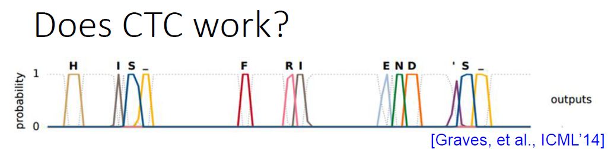 

* The y-axis shows the assigned probability
* The dotted line is for ∅
* It kinda works !

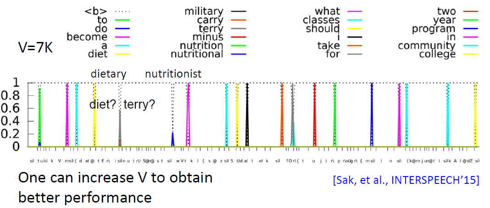 

* The figure above showed the result of a CTC with V = 7000 on a unseen test speech data
* The vocabulary does not have the word "dietary"
* The model outputs "diet" and "terry" instead
* The "community" has two consecutive peaks, the model "stutters"
* Increase **V** improves performance

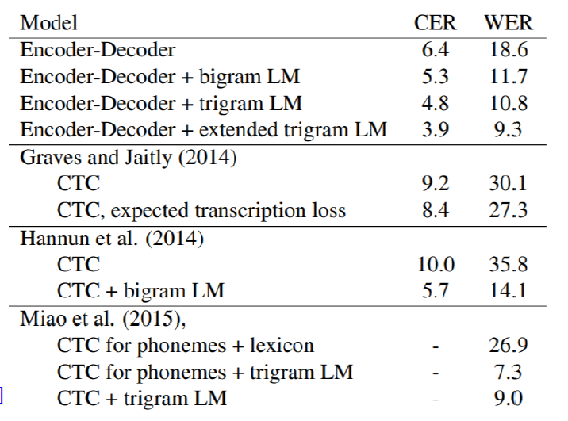

* The figure above shows that CTC without post-processing have bad performance
* Due to CTC requires post-processing, there are some with opinion that it should not be considered an end-to-end model

### Issue with CTC

* The classifier at each time step decodes independently
* For example, if the model is supposed to decode only one *c*
* Instead, the output sequence is:
    > <code> c ∅ c </code>
* At the third time step, it outputs *c* again 
* The model "stutters"
* The classifier does not know ∅ is generated at second time step
* This is only an exaggerated example
* The encoder is a RNN, it still can pass information from previous time steps

# RNN Transducer (RNN-T)

* Before taking about RNN-T, let's talk about Recurrent Neural Aligner (RNA)

## Recurrent Neural Aligner
* CTC decoder takes one vector or frame as input and outputs one token
* RNA adds dependency by changing it to a RNN decoder

 

* As shown in the figure above, the previous token distribution is used as input in current time step
* Similar to LAS decoder
* Can one vector maps to multiple tokens ?
* For example, can a vector maps to "th" ?
* Of course, you can add "th" as a new token in practice
* But we want our model to be flexible 
* RNN-T is the solution to this question !

## RNN Transducer

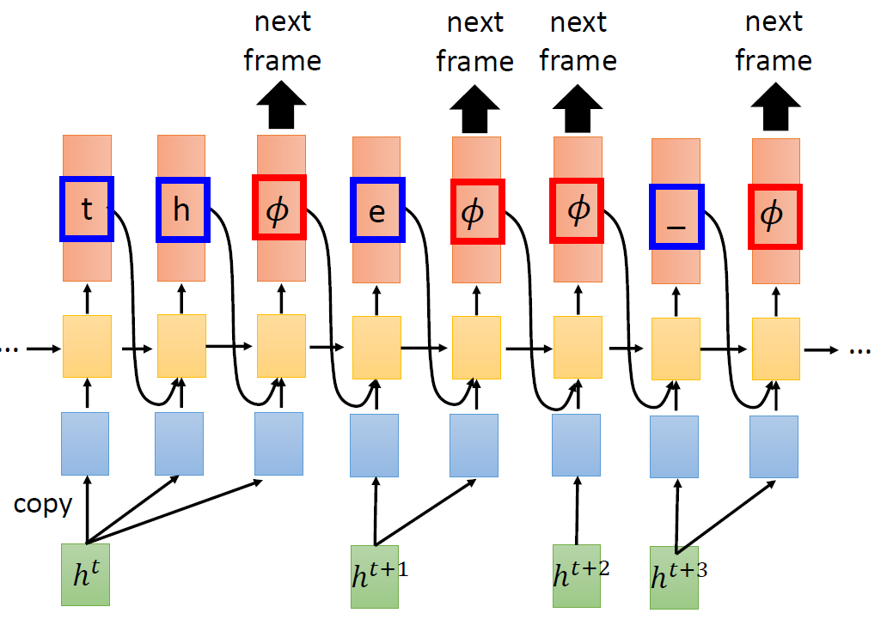 

* At a time step, continues to take in the same hidden state output and  outputs token until ∅ is outputted
* After the model outputs ∅, go to the next frame
* This enable the model to output multiple tokens for a frame
* Have the same alignment problem as CTC, how to utilize all of the possible alignments during training ?
* Addition of an extra RNN which acts as Language Model

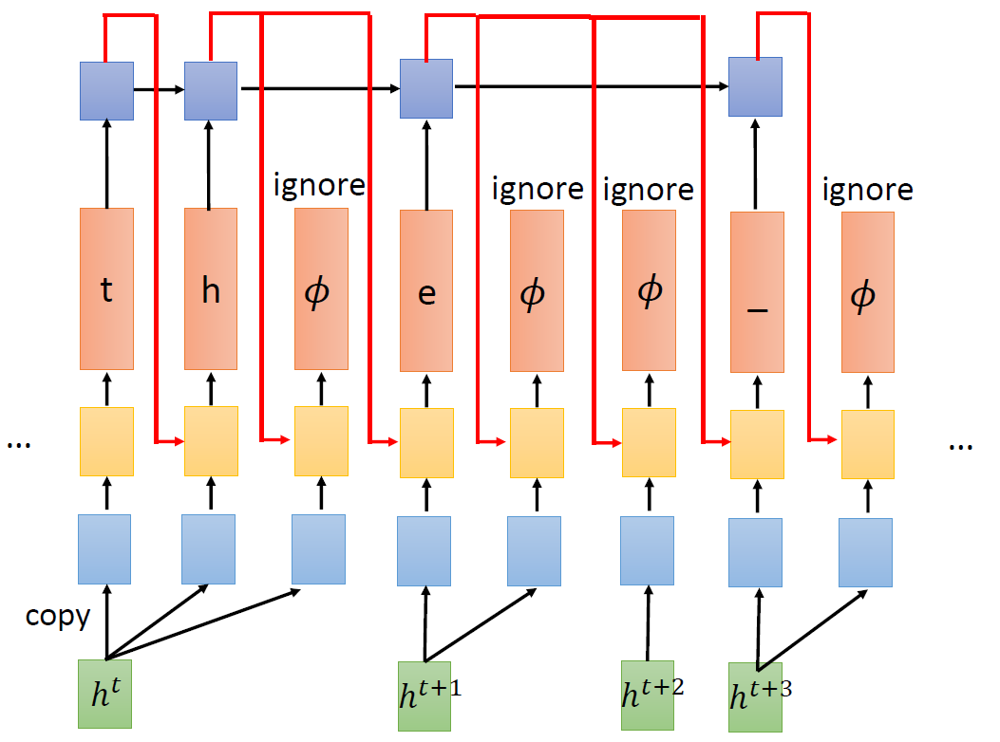 

* The additional RNN takes the generated output as input 
* The output of the RNN is consumed as input by RNN-T to generate the next tokens
* This RNN will ignore ∅
* Why need to have an extra RNN at decoder ?
    * It acts as Language Model, can easily collect texts and train
    * It is critical for training algorithm
    * We need an algorithm which can enumerate all possible alignments during training, which has a pre-condition of ignoring ∅

# Neural Transducer

* RNN-T reads acoustic feature one at a time 
* Neural transducer reads a bunch of acoustic features 

 

* It applies attention to a window of acoustic features, generates tokens until ∅ is generated
* Then, the window is moved, the same thing is repeated with new acoustic features in the window
* The decision to focus on which acoustic features in the window is determined by attention mechanism

 

* The figure above shows the effects of window size
* Without using attention: only take in the last acoustic feature in the window
    * The model performance deteriorates as window size increases
* LSTM-attention : the attention weights at current time step is passed to a LSTM
* The results show that as long as there is attention mechanism, the window size does not matter

# Monotonic Chunkwise Attention (MoCHA)

* Similar to Neural Transducer, with some modification at the attention
* Dynamicly shift the window

 

* Have an extra component which decides to place window at certain time step or not
* If yes, place the window and vice versa
* This model only output one token for each window
* Does not output ∅
* The output of **here?** is binary, cannot different binary, how to deal with this, refer to the paper [Chiu, et al., ICLR’18]

# Summary

| MODEL             | Description                                                                                |
|-------------------|--------------------------------------------------------------------------------------------|
| LAS               | Seq2Seq                                                                                    |
| CTC               | Seq2Seq with linear classifier as decoder                                                  |
| RNA               | Seq2Seq, 1-to-1                                                                            |
| RNN-T             | Seq2Seq, 1-to-many                                                                         |
| Neural Transducer | Seq2Seq, input one window Takes in multiple acoustic features, outputs multiple tokens  |
| MoCHA             | NT, dynamic shift window Takes in multiple acoustic features, output 1 token per window |