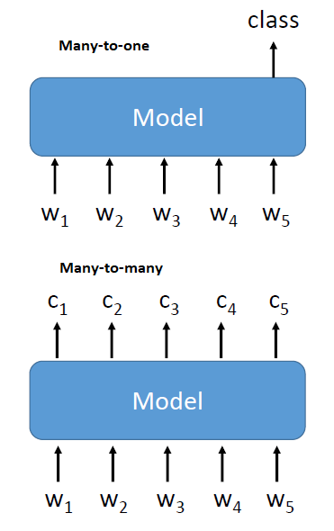
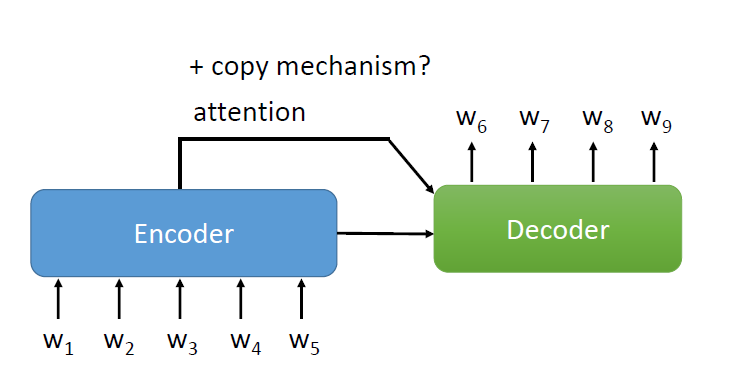
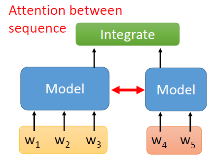
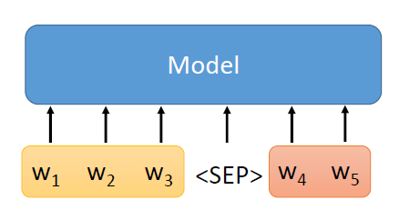
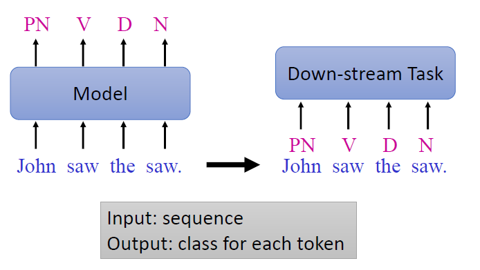
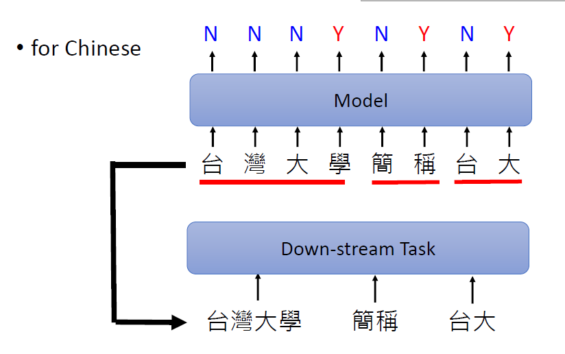

# Natural Language Processing (NLP) Tasks

* NLP tasks are text processing tasks
* Involves taking text as input
* However, some people might include *speech* in NLP
* Here, the focus is on text processing
* Can be classified based on input and output

| Input  | Output | Application                                              |
|--------|--------|----------------------------------------------------------                               |
| Text   | Text   | Chat-bot, translation, summarization, question answering |
| Text   | Class  | Sentiment 

# Category of NLP tasks
* Based on Input-Output Type

# Based on Input-Output Type

## Category "Text to Class"

* Input: Text
* Output: Class
* There are two types of **Text-to-class** problem
    * Many-to-one classification
    * Many-to-many classification

* *w* denotes token of word
* Each token belong to a word
* A sequence of words are represented using a sequence of token
* Many-to-many : Classification at every time step. Classify each token belong to which category
    * Example task : POS tagging
* Many-to-one : Prediction at the final time step
    * For example, sentiment classification. Given a sentence, classify the sentiment of the sentence
* Old way : Using LSTM
* Currently : use **BERT** and its variants to solve this problem

## Category "Text-to-Text"

* Input: Text
* Output: Text

### One sequence as Input, One sequence as Output

* Given a sentence, generates a sentence
* Uses sequence-to-sequence model which consists of Encoder and Decoder
* Sometimes, there is some sort of attention mechanism between Encoder and Decoder
* For some tasks, there is copy mechanism. There is no need to generate sentence from scratch. Can copy something from the input
    * For example, summarization task
### Multiple sequence as Input

* Let say we have two sentences :
  * w1, w2, w3
  * w4, w5
* Connect each sentence to different models which act as encoders
* Then, pass the encodings to another network which integrates them
* The integrating network can be used for classification or outputing text
* When encoding sentences, left sentence may require info from sentence on the right, we can have some sort of attention between these encoder models
* More popular method these days are "simpy concatenate"

* Use a special token such as **< SEP >** to seperate the sentence 

# Categories of NLP Tasks

<table class="tg">
<thead>
  <tr>
    <th class="tg-0pky"></th>
    <th class="tg-fymr">One Sequence</th>
    <th class="tg-fymr">Multiple Sequences</th>
  </tr>
</thead>
<tbody>
  <tr>
    <td class="tg-fymr">One Class</td>
    <td class="tg-0pky">Sentiment Classification Stance Detection Veracity Prediction Intent Classification Dialogue Policy</td>
    <td class="tg-0pky">NLI Search Engine Relation Extraction</td>
  </tr>
  <tr>
    <td class="tg-fymr">Class for each token</td>
    <td class="tg-0pky">POS tagging Word segmentation Extractive summarization Slot Filling NER</td>
    <td class="tg-0pky"></td>
  </tr>
  <tr>
    <td class="tg-fymr">Copy from input</td>
    <td class="tg-0pky"></td>
    <td class="tg-0pky">Extractive QA</td>
  </tr>
  <tr>
    <td class="tg-fymr">General Sequence</td>
    <td class="tg-0pky">Abstractive summarization Translation Grammar correction NLG</td>
    <td class="tg-0pky">General QA Task Oriented Dialogue Chatbot</td>
  </tr>
  <tr>
    <td class="tg-fymr">Other</td>
    <td class="tg-0pky" colspan="2">Parsing, conference resolution</td>
  </tr>
</tbody>
</table>

# Summary of Each Task

# Part-of-Speech (POS) Tagging 

* This task annotates each word in a sentence with a Part-of-Speech Tag 
* Examples of POS:
    * verb, adjective, noun

* Why is the usage of POS tagging ?
* Can think of it as text preprocessing or feature extractor
* The POS tag can be used as input for a down-stream task
* Can pass the sentence with its POS tags to the model of down-stream task
* The down-stream tasks are usually much more complex 
* Therefore, POS tags may provide additional information about the sentence which may improve the performance on down-stream task
* But recently, some models for down-stream tasks are already quite powerful that they might not require POS tagging as input
* For example, BERT has the ability to do POS tagging
* Whether POS tagging has become obsolete or not is still an open discussion

# Word Segmentation

* For languages such as Chinese, not required for English
* English words have spacing to divide them
* This is not the case for Chinese langauge
* There exists ambiguity 
* 台湾大学 can be :
    * a word 
    * or two separate words: 台湾 and 大学
* It becomes a binary classification for each Chinese characters : Yes or No
* Yes (Y) marks the boundary of the word
* Similar to POS tagging, the segmented words can be used as input for down-stream task 
* Also open to discussion whether it's necessary
* Because BERT probably can do word segmentation

