# Natural Language Processing (NLP) Tasks

* NLP tasks are text processing tasks
* Involves taking text as input
* However, some people might include *speech* in NLP
* Here, the focus is on text processing
* Can be classified based on input and output

| Input  | Output | Application                                              |
|--------|--------|----------------------------------------------------------                               |
| Text   | Text   | Chat-bot, translation, summarization, question answering |
| Text   | Class  | Sentiment 

# Table of Content

* [Category of NLP tasks](#Category-of-NLP-tasks)
  * [Categories of NLP Tasks: A summary](#Categories-of-NLP-Tasks)
* [Part-of-Speech (POS) Tagging](#Part-of-Speech-(POS)-Tagging)
* [Parsing](#Parsing)
* [Conference Resolution](#Conference-Resolution)
* [Summarization](#Summarization)
  * [Extractive Summarization](#Extractive-Summarization)
  * [Abstractive Summarization](#Abstractive-Summarization)
* [Machine Translation](#Machine-Translation)
* [Grammar Error Correction](#Grammar-Error-Correction)
* [Sentiment Classification](#Sentiment-Classification)
* [Stance Detection](#Stance-Detection)
* [Veracity Prediction](#Veracity-Prediction)
* [Natural Language Inference (NLI)](#Natural-Language-Inference-(NLI))
* [Search Engine](#Search-Engine)
* [Question Answering (QA)](#Question-Answering-(QA))
* [Dialogue](#Dialogue)
  * [Chatting](#Chatting)
  * [Task-oriented](#Task-oriented)
    * [Natural Language Generation (NLG)](#Natural-Language-Generation-(NLG))
    * [Policy & State Tracker](#Policy-&-State-Tracker)
    * [Natural Language Understanding (NLU)](#Natural-Language-Understanding-(NLU))
* [Knowledge Graph](#Knowledge-Graph)
  * [Name Entity Recognition (NER)](#Name-Entity-Recognition-(NER))
  * [Relation Extraction](#Relation-Extraction)
* [Datasets](#Datasets)

# Category of NLP tasks
* Based on Input-Output Type

# Based on Input-Output Type

## Category "Text to Class"

* Input: Text
* Output: Class
* There are two types of **Text-to-class** problem
    * Many-to-one classification
    * Many-to-many classification

* *w* denotes token of word
* Each token belong to a word
* A sequence of words are represented using a sequence of token
* Many-to-many : Classification at every time step. Classify each token belong to which category
    * Example task : POS tagging
* Many-to-one : Prediction at the final time step
    * For example, sentiment classification. Given a sentence, classify the sentiment of the sentence
* Old way : Using LSTM
* Currently : use **BERT** and its variants to solve this problem

## Category "Text-to-Text"

* Input: Text
* Output: Text

### One sequence as Input, One sequence as Output

* Given a sentence, generates a sentence
* Uses sequence-to-sequence model which consists of Encoder and Decoder
* Sometimes, there is some sort of attention mechanism between Encoder and Decoder
* For some tasks, there is copy mechanism. There is no need to generate sentence from scratch. Can copy something from the input
    * For example, summarization task
### Multiple sequence as Input

* Let say we have two sentences :
  * w1, w2, w3
  * w4, w5
* Connect each sentence to different models which act as encoders
* Then, pass the encodings to another network which integrates them
* The integrating network can be used for classification or outputing text
* When encoding sentences, left sentence may require info from sentence on the right, we can have some sort of attention between these encoder models
* More popular method these days are "simpy concatenate"

* Use a special token such as **< SEP >** to seperate the sentence 

# Categories of NLP Tasks

<table class="tg">
<thead>
  <tr>
    <th class="tg-0pky"></th>
    <th class="tg-fymr">One Sequence</th>
    <th class="tg-fymr">Multiple Sequences</th>
  </tr>
</thead>
<tbody>
  <tr>
    <td class="tg-fymr">One Class</td>
    <td class="tg-0pky">Sentiment Classification Stance Detection Veracity Prediction Intent Classification Dialogue Policy</td>
    <td class="tg-0pky">NLI Search Engine Relation Extraction</td>
  </tr>
  <tr>
    <td class="tg-fymr">Class for each token</td>
    <td class="tg-0pky">POS tagging Word segmentation Extractive summarization Slot Filling NER</td>
    <td class="tg-0pky"></td>
  </tr>
  <tr>
    <td class="tg-fymr">Copy from input</td>
    <td class="tg-0pky"></td>
    <td class="tg-0pky">Extractive QA</td>
  </tr>
  <tr>
    <td class="tg-fymr">General Sequence</td>
    <td class="tg-0pky">Abstractive summarization Translation Grammar correction NLG</td>
    <td class="tg-0pky">General QA Task Oriented Dialogue Chatbot</td>
  </tr>
  <tr>
    <td class="tg-fymr">Other</td>
    <td class="tg-0pky" colspan="2">Parsing, conference resolution</td>
  </tr>
</tbody>
</table>

# Summary of Each Task

# Part-of-Speech (POS) Tagging 

* This task annotates each word in a sentence with a Part-of-Speech Tag 
* Examples of POS:
    * verb, adjective, noun

* Why is the usage of POS tagging ?
* Can think of it as text preprocessing or feature extractor
* The POS tag can be used as input for a down-stream task
* Can pass the sentence with its POS tags to the model of down-stream task
* The down-stream tasks are usually much more complex 
* Therefore, POS tags may provide additional information about the sentence which may improve the performance on down-stream task
* But recently, some models for down-stream tasks are already quite powerful that they might not require POS tagging as input
* For example, BERT has the ability to do POS tagging
* Whether POS tagging has become obsolete or not is still an open discussion

# Word Segmentation

* Input : sequence
* Output: Class for each token
* Similarly can be viewed as a type of text preprocessing for other down-stream tasks
* For languages such as Chinese, not required for English
* English words have spacing to divide them
* This is not the case for Chinese langauge
* There exists ambiguity 
* 台湾大学 can be :
    * a word 
    * or two separate words: 台湾 and 大学
* It becomes a binary classification for each Chinese characters : Yes or No
* Yes (Y) marks the boundary of the word
* Similar to POS tagging, the segmented words can be used as input for down-stream task 
* Also open to discussion whether it's necessary
* Because BERT probably can do word segmentation

# Parsing

* Given a sentence, produce a tree structure which describe the relationship of words of the sentence

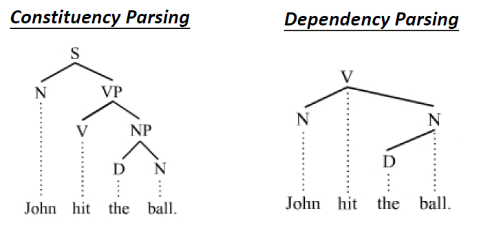

* Two types of parsing :
  1. Constituency Parsing 
  2. Dependency Parsing
* Similarly can be viewed as a type of text preprocessing for other down-stream tasks
* Similarly, it's also open for discussion because BERT seems to be able to do parsing

# Conference Resolution

* Given a body of text, classify which words belong to the same entity

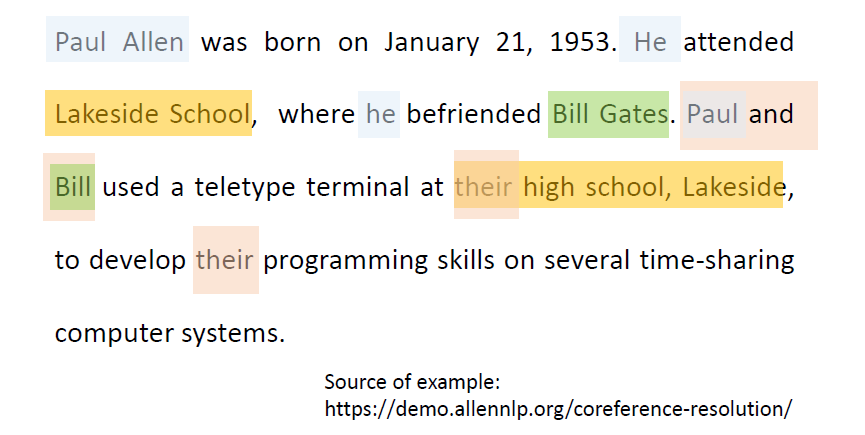

* For example :
  * *Paul Allen* and *He* belong to same entity
  * *Bill Gates* and *Bill* belong to same entity

# Summarization

  There are two types of summarization :
  1. Extractive Summarization
  2. Abstractive Summarization

# Extractive Summarization

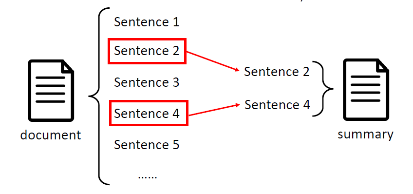

* Input : Sequence
* Output : Class for each token
* Each token is for a sentence
* Given a body of text, select some sentences and then combine them as summary
* It is a binary classification :
  * 0 : This token is not selected to be part of the summary
  * 1 : This token is selected as part of the summary
* Articles may have repeated sentences asserting the same thing. Once you select one, there's no need to select another
* We can probably train a Bidirectional LSTM to read entire text and classify each sentence
* In the past, this is considered to be adequate. However, not anymore

# Abstractive Summarization

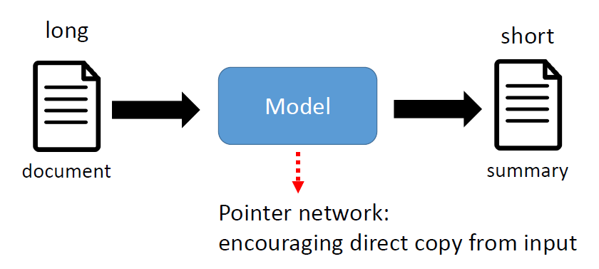

* Literally, Use own words to write a summary when given a text
* Some works on abstractive summarization share words between document and summary
  * It seems like cheating, but it's not. It's entirely justified
  * When humans summarize articles, it's inevitable to reuse some words from the articles
* Can be trained using a Sequence-to-Sequence (Seq2Seq) model

# Machine Translation

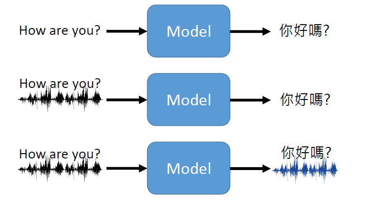

* Input : Sequence
* Output : Sequence

* Input can be text or audio in one language, output can be text or audio of target language
* Why audio ? There are a lot of languages that do not have writing system
* Prof. Lee thinks unsupervised Machine Translation is a critical research direction 
  * There are about 7000 languages in the world
  * For each pair of languages, we need annotated datasets for both language
  * To train Machine Translation model for every pair of languages, we would need 7000^2 datasets 

# Grammar Error Correction

* Input : Sequence
* Output : Sequence
* Examples :
  * Input : I are a alien
  * Output : I am an alien
* Use a Seq2Seq model
* Copying is encouraged 

# Sentiment Classification

* Input : Sequence 
* Output : Sequence
* Classify the sentiment of the given sentence
* Can be :
  * Binary classification : Good or bad
  * Multi-class classification : 1-5 stars or Sad, Happy, Angry etc
* Use a Seq2Seq model

# Stance Detection

* Input : Two sequences
* Output : A class

* Detect the stance of a Twitter posts based on the post and replies
  * Source : Soon Chang is a genius 
  * Reply : No he is not. He's a loser
  * Input : Source and comment
  * Output : Many systems use Support, Denying, Querying and Commenting (SDQC) labels to classify the replies

# Veracity Prediction

* "Fake news" detector
*  Veracity is the degree to which the information is accurate and trusted

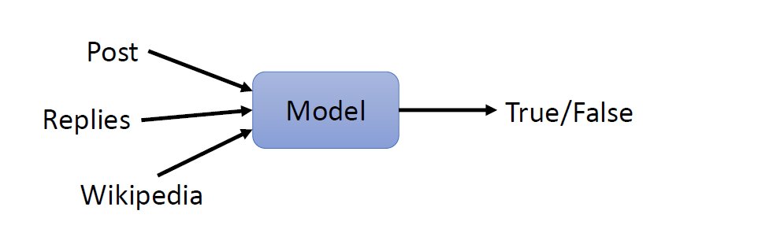

* A binary classification :
  * 1 : True
  * 0 : False
* Input : Post, replies, external sources such as Wikipedia or news site

# Natural Language Inference (NLI)

* Input : Two Sequences
* Output : A class
* Given two sentences as input:
  * a premise 前提 
  * a hypothesis 假设
* Output : One of the three classes
  * Contradiction 反驳 : Given two statements, both do not agree with one another
  * Entailment （语义或逻辑）蕴涵 ：Given two statements, if one is true, then the other one must be true
  * Neutral 中立
* Example :

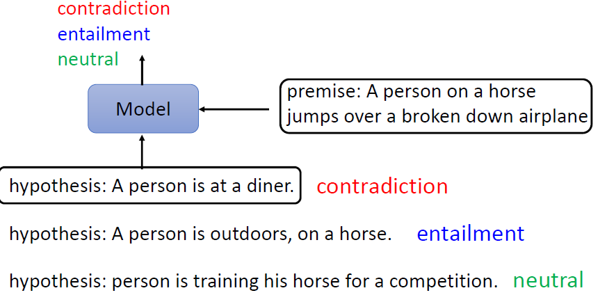

# Search Engine

* Input : 2 Sequences
* Output : A class
* Input : 
  1. Keywords for search
  2. Articles
* Output : Relevant ?
  * If relevant, put it at a higher order
* Google's blog says Google uses BERT in Google Search, [read more](https://www.blog.google/products/search/search-language-understanding-bert/)
* Search engine is more than this, other aspects of Search engine is not covered in this course

# Question Answering (QA)

* Input : Several sequences
* Output : Sequence
* Input : 
  * Knowledge source : An article 
  * Question
* Output : Answer to the question
* We hope QA model not only able to take in structured data, but also have the ability to read from unstructured documents such as websites from Search Engine results
  * This task is called Reading Comprehension
  * QA model needs to filter out irrelevant search results
* There is still a long way to go because mainstream research is still unable to spit out a complete answer 
* The QA model that's currently avaiable is called **Extractive QA**
  * Literally, select some words from the document as answer to the question
  * In other words, we force the model to copy from the text

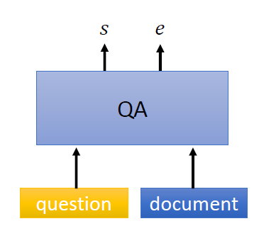

* Given the document and question, spits out *s* and *e*
  * *s* : Index of starting word
  * *e* : Index of ending word

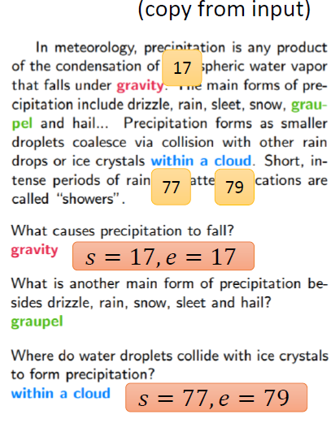

* If *s* ≤ *e*, then there's answer
* Else, the model is considered to be unable to answer the question

# Dialogue

* Two Types :
  * Chatting
  * Task-oriented 

# Chatting

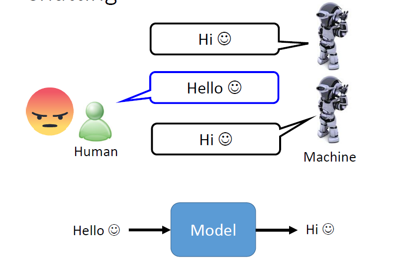

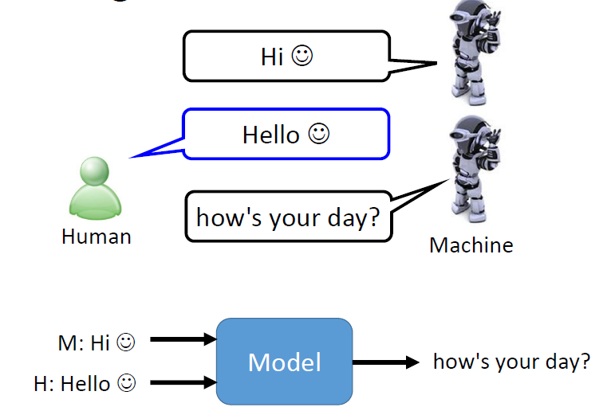

* Input : Previous chat history + User current input
* Output : Reply

# Task-oriented

* Conversation to help human with some tasks such as booking ticket, restaurant etc

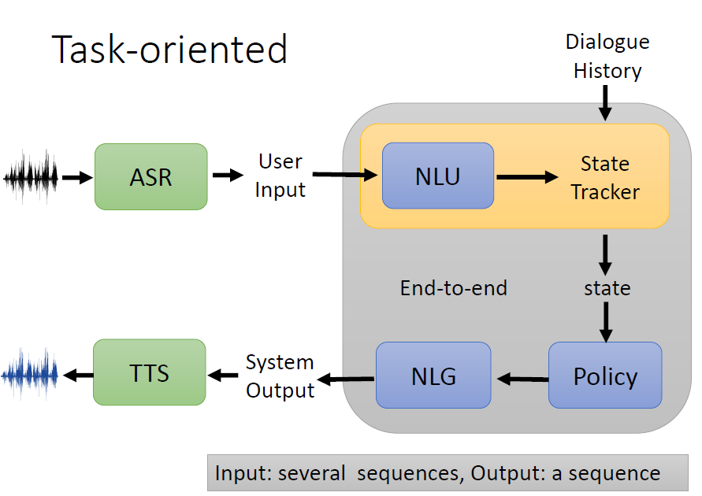

* The main idea is to break down a complex model into several smaller component models 
  * NLU : Natural Language Understanding
  * Policy & State Tracker
  * NLG : Natural Language Generation 
* We are going to break down it step by step starting with NLG

## Natural Language Generation (NLG)

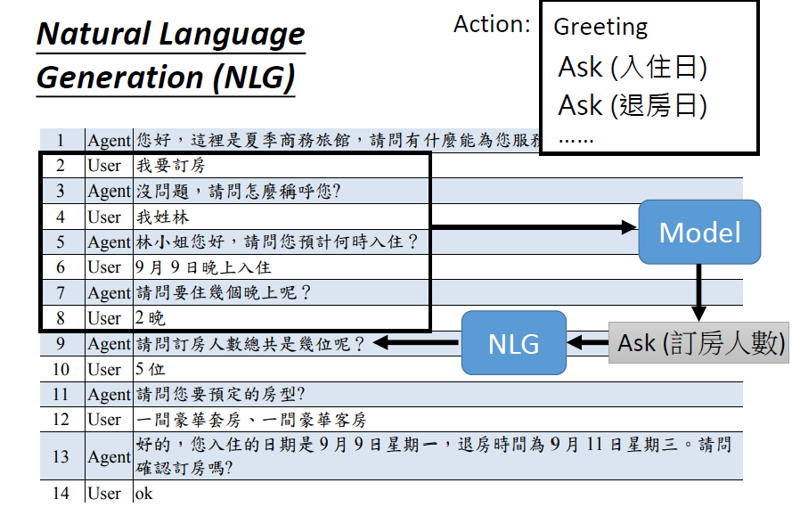
    <caption style="text-align:center">Above figure : Reserve a hotel room</caption>

* For task-oriented dialogue, the replies of a model are limited
* We can narrow down to several pre-defined and fixed actions such as :
  * Ask (Check-in date)
  * Ask (Check-out date)
* A model takes in *chat history* and outputs an action to be taken
* NLG generates text replies based on the action to be taken
* If do not have many actions, can use rule-based reply. For example :
    * If action A, use reply A
    * If action B, use reply B
* If there are many actions, maybe can train a model to generate reply

## Policy & State Tracker

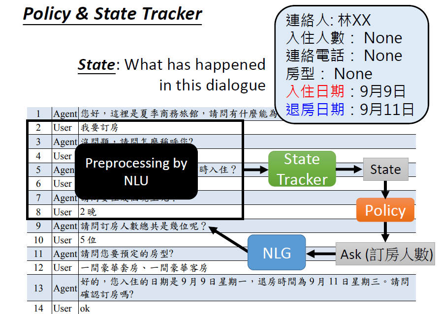

* Note : Ignore the NLU part for now
* State : A summary of what has happened in the dialogue
* Example of state : 
  * Name
  * Phone number
  * Check-in date
  * Check-out date
* A state tracker keeps relevant info from the past dialogue and filter out irrelevant stuffs
  * Input : Past conversation or dialogue (Processed by NLU)
  * Output : States
* A policy model :
  * Input : Sequence (state)
  * Output : A class (Actions to be taken)
* Policy model becomes a multi-class classification
* However, there are no labeled dataset. We can use Reinforcement Learning to learn the policy model
* Then, the NLG generates text based on action which is predicted by the policy model
* Recent systems can do this end-to-end
  * Past system use NLU to preprocess the dialogue before feeding it to the state tracker

## Natural Language Understanding (NLU)

* Intent Classification
* Slot Filling

## Slot Filling

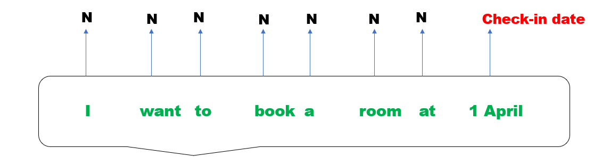

* Given a sequence, classify each of the token with a slot
* A slot is a category of information such as :
  * Check-in date
  * Check-in date
  * and Irrelevent (N)
* Similar to POS tagging
* If have a excellent Slot Filling machine, we can use rule-based system to build state tracker. This only work if the customer states everything directly
* If customer says something ambiguous or indirect such as :
  * " I want to book the room for two days "
* It doesn't give the exact date. Therefore, might need a more complex rule-based system which consider more conditions or train a model as state tracker

# Knowledge Graph

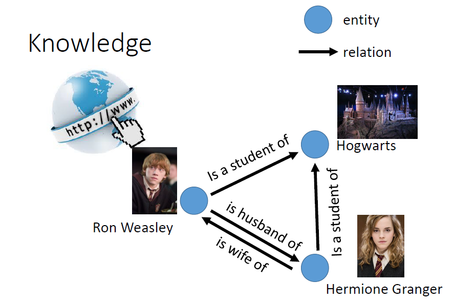

* Nodes represent entity such as people, time, place
* Edges represent relations between entity

There are two directions of research :

## Directions: 

1.  Given a knowledge graph, how to use it in the task you are concerned, ie. QA, summarization
2.  Given large amount of text, generate knowledge graph
  * For example, build a knowledge graph of the characters after reading Harry Potter novels
The steps :
1. Extract Entity
2. Extract Relation

# Name Entity Recognition (NER)

* Extract / Select the entity of your interest from the text 
* Entity of interest is dependent on applications
* People, organizations, places are usually name entity
* Similar to POS tagging and slot filling

## Implementation 

* Input : Sequence (Sequence of tokens )
* Output : Class for each token (What entity ?)

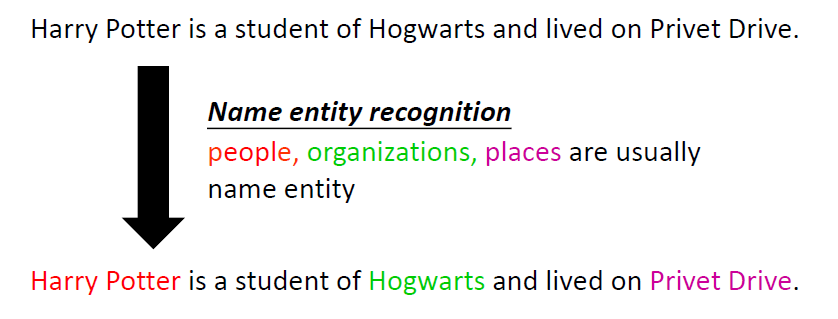

* Only NER alone is not enough to solve entity extraction task of knowledge graph

# Relation Extraction

* If limits the types of relation, it can be reduced to a classification problem
* Often not helpful

# Datasets

# [General Language Understanding Evaluation (GLUE)](https://gluebenchmark.com/)

* Designed to evaluate general language understanding of a NLP model
* Consists of many tasks such as :
  * Corpus of Linguistic Acceptability (CoLA)
  * Stanford Sentiment Treebank (SST-2)
  * Microsoft Research Paraphrase Corpus (MRPC)
  * QuoraQuestion Pairs (QQP)
  * Semantic Textual Similarity Benchmark (STS-B)
  * Multi-Genre Natural Language Inference (MNLI)
  * Question-answering NLI (QNLI)
  * Recognizing Textual Entailment (RTE)
  * WinogradNLI (WNLI)

* Since BERT and friends were introduced, more datasets with elevated difficulties were introduced. 
* Includes tasks such as QA
* Datasets :
  * [Super GLUE](https://super.gluebenchmark.com/)
  * [DecaNLP](https://decanlp.com/)
