# Speech Separation

* Human can focus on the voice produced by a single speaker in a crowded and noisy environments
* This task is known as **Speech Separation**
* Speech Separation can be used for :
    * Speech Enhancement
    * Speaker Separation
* **Speech Enhancement** involves separation of speech and non-speech separation
    * Non-speech : Background noise
    * Is also known as Denoising
* Speaker Separation means separating voices of different speakers who are talking at the same time

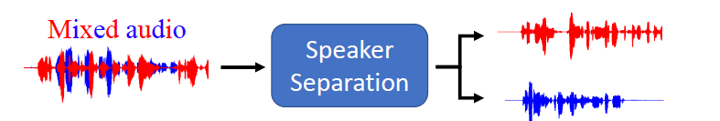

* Here, we are going to focus on the case of :
    * Two speakers
    * One microphone
    * Speaker independent : training and testing speakers are completely different 
* The input and output have the same length
* Seq2seq model is not needed :
    * It's more suited when input and output have different length
    * It's an overkill for input and output with the same length
* Training data can be easily obtained
* Don't have to collect mixed audio

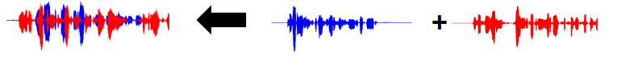

* Can easily generate training data by mixing speech of different speakers together
* One advantage of doing this is that we have the ground truth speech of different speakers

## Evaluation

* Since we have ground truth for Speaker Separation, we can evaluate the result
* This is unlike for voice conversion where we do not have the ground truth. Therefore, we are unable to evaluate the result

### Signal-to-noise ratio (SNR)

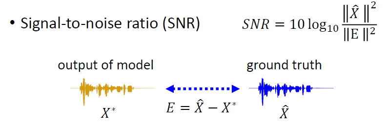

* The output of the model is denoted by <code>X*</code>
* The ground truth is denoted by <code>X^</code>
* Both of them are sound signal, can be thought of as very long vectors
* How long ? If the sampling frequency is 16kHz, every second consists of 16000 points. One second of sound signal is a vector consists of 16000 dimensions
* *E* denotes the difference of both vectors
* The SNR formula is given in the figure above
* We want the SNR value as large as possible
* If the difference *E* is small, SNR increases
* If there is no difference, SNR would be infinity since *E* = 0
* There are two issues with SNR :

**Issue 1 :**

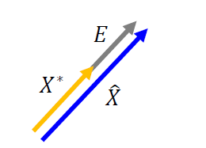

* Both are very long vectors
* <code>X*</code> is a good, but the volume is lower 
* We just have to raise the volume
* This difference results in a low SNR
* SNR is unable to recognize that it's a good output

**Issue 2 :**

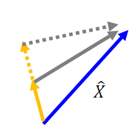

* As shown in the figure, we can increase SNR by :
    * Increase the volume of model's output
    * Which reduces the *E*
* SNR might not be a good metric at all for Speaker Separation

### Scale invariant signal-to-distortion ratio (SI_SDR)

* Also known as SI-SNR

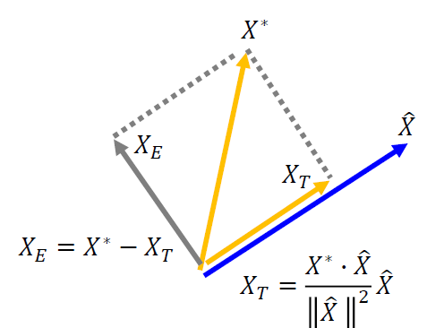

* We project the model's output <code>X*</code> to the ground truth and the vector orthogonal to ground truth to obtain :
    * <code>X_T : Projection of X* onto X^</code>
    * <code>X_E : Projection of X* onto vector orthogonal to X^</code>

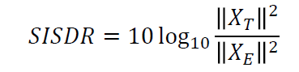

* The formula for SI-SDR is given in the figure above

**How does it solves the issue faced by SNR ?**

**Issue 1 :**

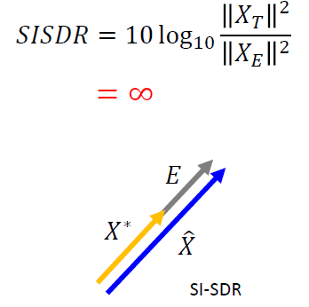

* The first issue is difference in volume, but the vectors are parallel
* For SI-SDR :
    * <code>X_E</code> = 0 
    * SI-SDR = infinity
* The output is perfect

**Issue 2 :**

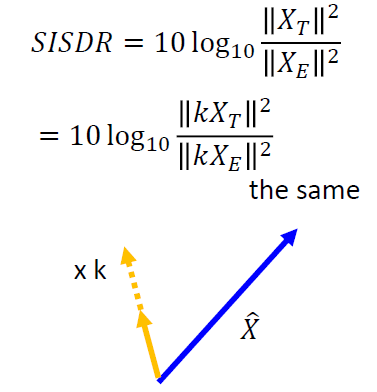

* The second issue is that raising the volume of the model's output will increase SNR
* For SI-SDR, the scaling factor *k* appears on the numerator and denominator, cancels off each other
* No matter by how much the model's output is scaled, the SI-SDR would remain the same

### Improved SI-SDR

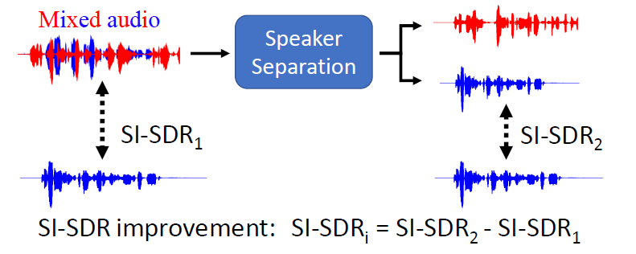

* SI-SDR 1 : The SI-SDR between the ground truth and the mixed audio
* SI-SDR 2 : The SI-SDR between the ground truth and the model's output
* The formula is given in the figure above

### Other evaluation 

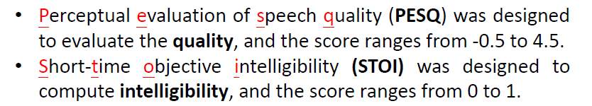

* Intelligibility means more comprehensible

### Permutation Issue 

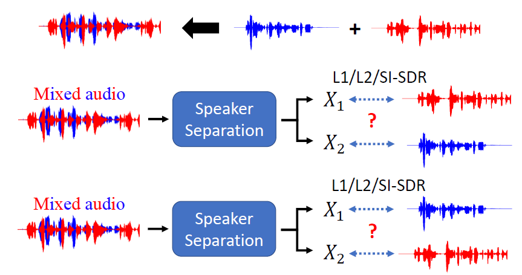

* We do not know to place the ground truths
* The output on top is denoted by X1 and the output on the bottom is denoted by X2
* The model may output the separated speech of the speaker at X1 or X2. We simply do not know
* For the case of 2 speakers, there are two ways to arrange the ground truths as shown in the figure above

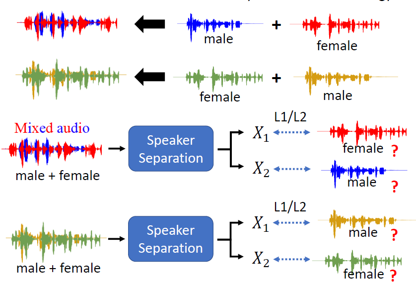

* Some may suggest to arrange the ground truths based on gender or pitch, but this is not a good suggestion
* Arranging the ground truths according to gender is not necessarily right because some female voices are deep 
* Arranging the ground truths based on pitch, we can have cases where both ground truths have low pitch
* To conclude, we do not know which is the correct placement of ground truths in advance
* This is the problem faced by researchers then, can only do speaker dependent speech separation
* The earliest solution to the permutation issue is **Deep Clustering** proposed on 2016

## Deep Clustering Prior

### Masking

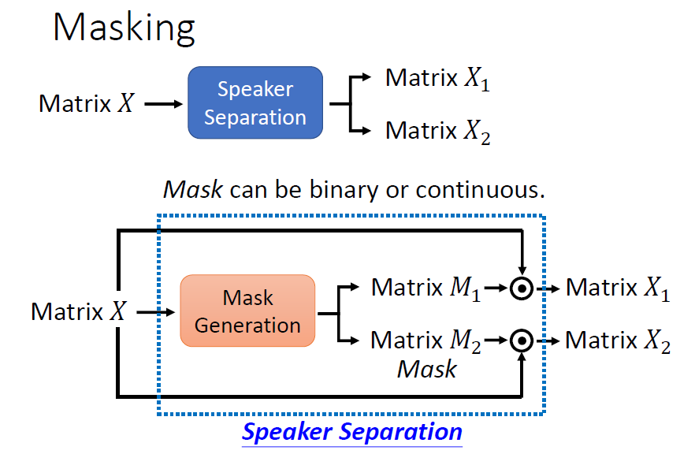

* Speaker separation can split matrix X into 2 matrices X1 and X2
* If we train a model to do this, seems like an overkill
* X1 and X2 do not differ to much from X
* This is because X1 and X2 are obtained by subtracting something from X
* Considering this trait, we do not really need to train a general model for speaker separation
* Instead, we can use **masks**
* Masks are matrices with same size as the input X
* In the figure, masks are denoted by M1 and M2
* We do element-wise multiplication of X with M1 to obtain X1 
* Similarly, multiply X and M2 to obtain X2
* The mask can be binary or continuous

### Ideal Binary Mask

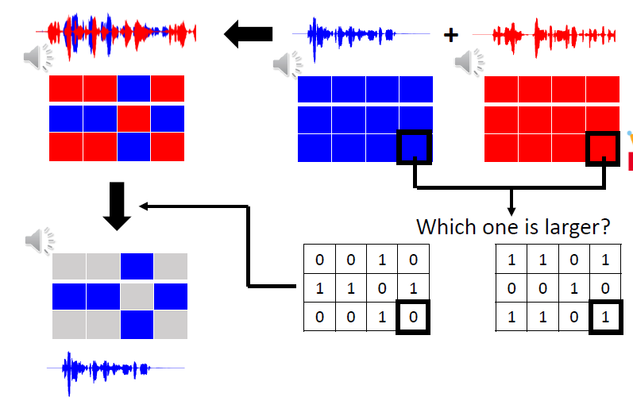

* The figure above shows two audio: blue and red
* Each audio is represented by its spectrogram on the top right of the figure
* Comparing the value of the spectogram at each position :
    * Fill in 1 in the same position of the mask that belongs to the speaker with a larger value
    * Fill in 0 in the same position of the mask that belongs to the speaker with a smaller value
* After that, multiply the mask with the spectrogram of mixed audio to retrieve each individual audio
* Surprisingly, the result is pretty good

**Issues with IBM**

* Not easy to task to produce IBM
* Need ground truth or audio of individual speakers to obtain the mask
* However, our task is source separation in which we are given the mixed audio but not the original individual audio
* We can learn a model to generate **IBM** 
    * Testing data does not have ground truth
    * Only the training data has ground truth for obtaining IBM
* **IBM does not solve permutation issue**
* However, both masks are related. The values at the same position for both masks are dependent
    * If one of them is 1, its counterpart would be 0

## Deep Clustering 

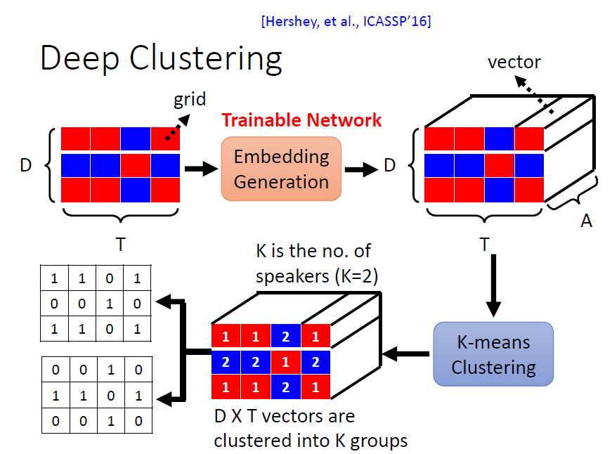

* The input is a spectrogram of mixed audio
    * Blue and red : Each represents a unique speaker
    * It is a matrix of size <code> D x T</code>
* The input spectrogram is fed into a **trainable** network for embedding generation
* The output of embedding generation is a 3D matrix of size <code> D x T x A </code>
    * This means each of the grid which consists of a scalar is transformed into a vector of length <code>A</code>
    * The network does not just look the the grid to generate the vector
    * In fact, it looks at the surrouding grids to generate a vector for each individual grid
* Then, **K-means clustering** is applied to the matrix
* In this case, K = 2 since we have 2 speakers 

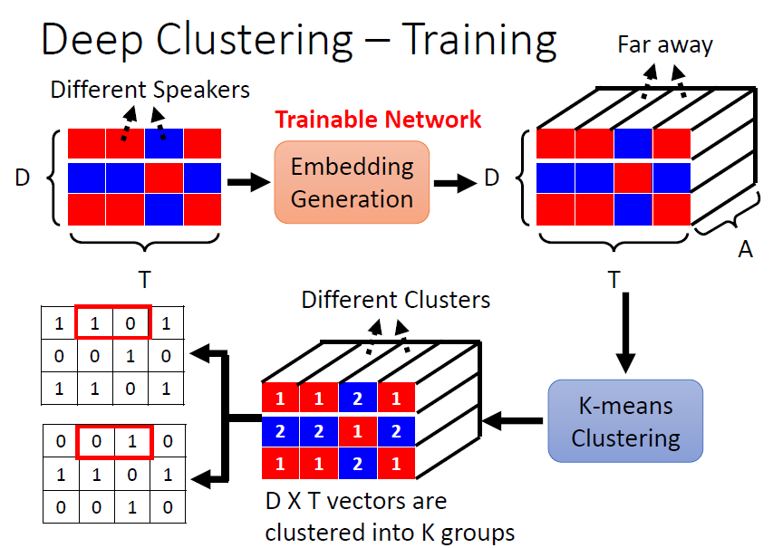

* Grids of different speakers have vectors which are far away from each other (distance on vector space)

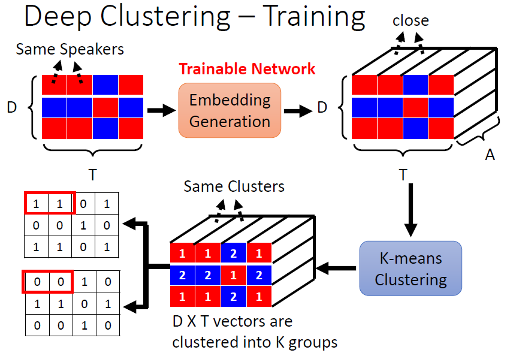

* Grids of same speaker have vectors which are close to each other (distance on vector space)
* K-means clustering algorithm can use this trait to generate masks to split the vectors into **K** groups
* It is possible to train the network for embedding generation with 2 speakers, but test on three speakers (K=3 during K-means clustering)
* During testing, it can separate out grids for 3 different speakers, it works
* The **disadvantage** is that deep clustering is not an end-to-end approach

## Permutation Invariant Training (PIT)

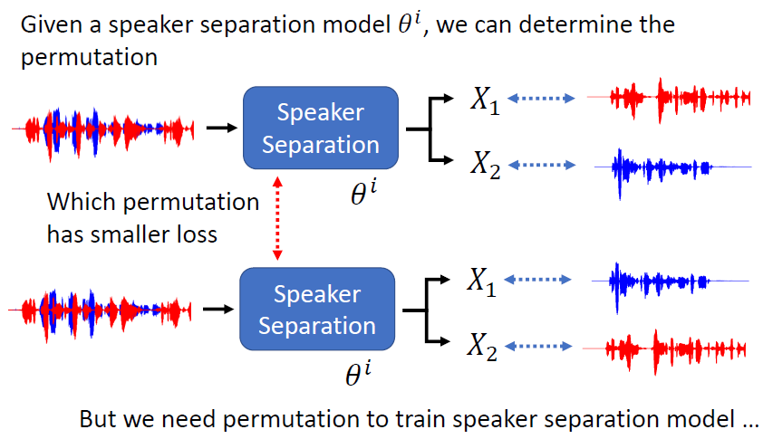

* As shown in the figure, there are 2 possible placement permutations
* We can place it in the permutation which has smaller loss
* Placement with smaller loss is better or more suitable
* Loss can be computed only with a trained speaker separation model
* We need to identify the more suitable permutation in order to train the model
* It has become a chicken and egg problem

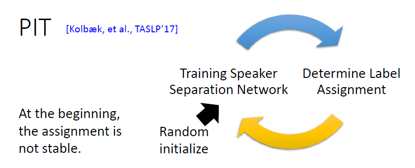

1. First, start from scratch by randomly initializes the parameters of the speaker separation model
2. Training speaker separation model
3. Use the trained model to determine label assignment
4. Repeat 2 and 3 iteratively 

* Because of random initialization of parameters, the assignment is not stable
* The speaker separation network will result in better label assignment over time
* This is turns improves the speaker separation network

